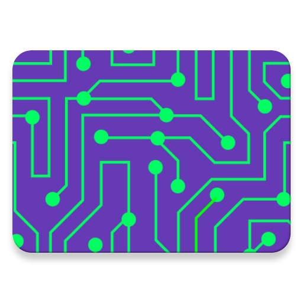

# cirkit_server
Server for cirkit client in nodejs and express.js

# Installing - Ubuntu/Linux/Mac(Probably)
One-liner:
>curl -sL https://raw.githubusercontent.com/TheNightmanCodeth/cirkit-server-core/master/install.sh | sudo -E bash -

Or, if you'd rather not pipe to bash with root:
>curl -sL https://raw.githubusercontent.com/TheNightmanCodeth/cirkit-server-core/master/install.sh  
>./install.sh

# Installing (Everything else (Experimental))
>Install Nodejs for your platform  
>npm install  
>Delete first line (`#!/usr/bin/env node`) from `cirkit`  
>Change `cirkit` to `cirkit.js`  
>Run `node cirkit.js &(args)`  
>For example: `node cirkit.js server start`  

# Usage - Unix
Setup:  
>Install server and client software  
>Register device with server (should auto-pair on first start, otherwise choose menu>set IP)  
Start server:  
>`cirkit server start`  
List devices that can receive pushes:  
>`cirkit devices`  
Push message to device  
>Get device ID from `cirkit devices`  
>`1: Name (ip address)`  
>^ device ID  
>`cirkit push "Message" $(id)`  

# Usage - Other 
>Same as unix, but should be `node cirkit.js` instead of `cirkit`  
>This will be fixed in the future!  
